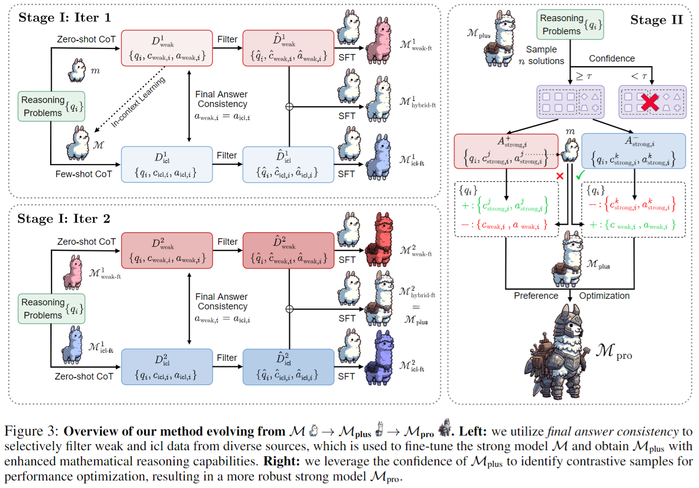

# Weak-to-Strong Reasoning

This is the official repository for the paper [Weak-to-Strong Reasoning](https://arxiv.org/abs/2407.13647).

## 🚀Introduction

We explore **weak-to-strong learning** for **complex reasoning tasks**, where a less capable model enhances the reasoning capabilities of a stronger one. Our progressive learning framework enables the strong model to autonomously refine its training data without requiring input from more advanced models or human-annotated data. The framework consists of two main stages:

1. **Supervised fine-tuning** on a selective, small, but high-quality dataset;
2. **Preference optimization** on contrastive samples identified by the strong model itself.

The overview of our framework is as follows:

<p align="center"> 

</p>

## 📖Resources

### Data

We split the training set into `train_1.jsonl` and `train_2.jsonl`:
- The weak model uses `train_1.jsonl` to develop initial reasoning skills;
- The strong model can only access questions from `train_2.jsonl` without ground truths.

The original data is available in `data/raw`. Note that we augment the GSM8K training set with the data constructed by [Abel](https://github.com/GAIR-NLP/abel).

#### Data Statistics

|       | train_1 | train_2 | test  |
|:------|:--------|:--------|:------|
| GSM8K | 7,000   | 7,000   | 1,319 |
| MATH  | 6,000   | 6,000   | 500   |

#### Additional Data Resources

- `outputs/`: Solutions generated by three weak models (llama2-7b, gemma-2b, and mistral-7b) for `train_2`.
- `data/test/`: Processed data for evaluation (created using `data/process.py`).
- `data/llama_factory/`: All data used for training (including stage I: supervised fine-tuning and stage II: DPO or ORPO).

### Checkpoints

We have released LoRA adapters that have undergone two-stage weak-to-strong training on [Hugging Face Hub](https://huggingface.co/collections/ayyyq/weak-to-strong-reasoning-668d54c115511820b9a8e418). The base model for all adapters is llama2-70b.

## 👓Inference

We provide inference code using vllm in the `src/` directory.

### Setup

1. Install the required packages:

```bash
pip install transformers==4.38.1 torch==2.1.2 vllm==0.3.3
```

2. Install any other necessary dependencies.

### Running Inference

Refer to `run_gsm8k.sh` and `run_math.sh` for zero-shot, few-shot, or temperature sampling inference. Few-shot templates can be found in `src/prompt/template.py`.

## 🛠️Training

### Constructing Training Data

To generate the actual training data (as provided in `data/llama_factory`), use `src/construct_training_data.py`:

1. For stage I (supervised fine-tuning):
   - Run the `construct_weak_icl_data` function to find the intersection of weak data and ICL data where final answers are consistent.

2. For stage II (preference optimization):
   - Generate sampling data with temperature=1.0.
   - Use `construct_paired_data_gsm8k` and `construct_paired_data_math` functions to create paired data.

### Training Process

We employ LLaMA-Factory for all model training:
- v0.5.0 for supervised fine-tuning and DPO
- v0.6.2 for ORPO support

All training data and `dataset_info.json` are provided in `data/llama_factory`. For detailed training instructions, please refer to the [LLaMA-Factory repository](https://github.com/hiyouga/LLaMA-Factory/tree/main).

## 🥳Citation
If you find our work useful, please cite our paper:
```bibtex
@misc{yang2024weaktostrongreasoning,
      title={Weak-to-Strong Reasoning}, 
      author={Yuqing Yang and Yan Ma and Pengfei Liu},
      year={2024},
      eprint={2407.13647},
      archivePrefix={arXiv},
      primaryClass={cs.CL},
      url={https://arxiv.org/abs/2407.13647}, 
}
```